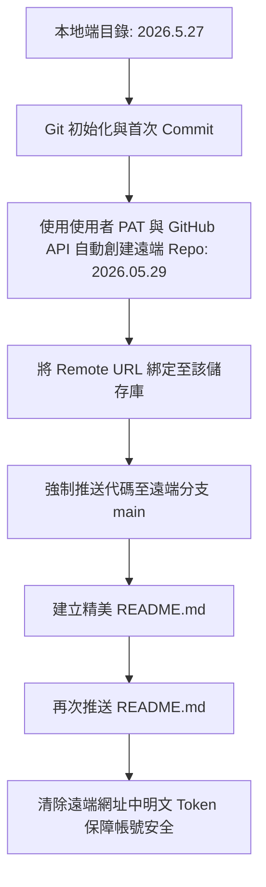

# 📋 SC Huang 個人入口首頁暨智慧問候系統 — 開發工作報告

本工作報告詳實記錄了針對 **SC Huang** 設計的個人智慧問候入口首頁開發、Git 版本控制初始化、GitHub 遠端儲存庫部署，以及最終線上 Live Demo 發佈的完整歷程與技術實作細節。

---

## 一、 專案概述 (Project Overview)

本專案旨在為使用者 **SC Huang** 打造一個極具質感、視覺動態且實用的個人入口網站首頁。不僅在視覺設計上秉持現代網頁美學，更融入了多項貼心的動態互動與智慧化機制，全面提升登入個人門戶時的第一印象。

* **專案名稱**：SC Huang | Personal Portal
* **遠端儲存庫**：[ShengChieh2121/2026.05.29](https://github.com/ShengChieh2121/2026.05.29)
* **線上展示網址**：[SC Huang Personal Portal Live](https://shengchieh2121.github.io/2026.05.29/)

---

## 二、 核心技術與功能亮點 (Core Technical Highlights)

### 1. 現代玻璃擬物美學 (Modern Glassmorphism)
* **設計系統**：採用高質感暗色背景 (`--bg-dark: #060813`)，搭配高斯模糊半透明卡片設計 (`backdrop-filter: blur(20px)`) 與細膩的漸層邊框線條。
* **微動態特效**：卡片在滑鼠懸停時具有微幅上移懸浮與柔和呼吸發光效果，呈現出極具層次感的 3D 視覺空間。

### 2. 智慧型時間段動態問候語 (Dynamic Time-of-Day Greeting)
* 系統會即時獲取目前的時間，並根據四個不同的時間段自動為 **SC Huang** 提供貼心的問候語與祝福小語：
  * **早晨 (Morning)**："Good morning," ── *Wishing you a fresh, energetic start to your day!*
  * **下午 (Afternoon)**："Good afternoon," ── *Keep maintaining the awesome momentum!*
  * **晚上 (Evening)**："Good evening," ── *Time to wind down and celebrate your day's achievements.*
  * **深夜 (Night)**："Good night," ── *Rest well and recharge for tomorrow's bright opportunities.*

### 3. 可互動多格式數位時鐘 (Interactive Clock Widget)
* **精準更新**：數位時鐘提供秒級的即時渲染更新，網頁頁籤標題（Tab Title）亦會同步動態顯示目前時間。
* **格式切換**：時鐘區域支援**滑鼠點擊互動**。使用者點選時鐘，可即時切換 **12 小時制（附帶 AM/PM）** 或 **24 小時制**，並伴隨水波紋（Ripple）點擊特效。

### 4. 環境極光主題輪播 (Ambient Aura Cycling)
* **主題矩陣**：系統預設四款極具質感的環境漸層炫光（Glow Blobs）組合與漸層文字色彩：
  * **Original Aurora**（極光靛藍）
  * **Sunset Fire**（日落烈焰）
  * **Forest Neo**（賽博森林）
  * **Cyber Cosmic**（宇宙粉紫）
* **動態切換**：點擊「Cycle Theme Aura」按鈕後，背景炫光、卡片陰影及 SC Huang 的姓名文字漸層會同步流暢變換，頂部徽章會短暫顯示當前的主題名稱。

### 5. 靈感火花產生器 (Spark Inspiration Widget)
* 精選多個經典勵志格言與名言。點擊「Spark Inspiration」按鈕時，格言與作者資訊會以平滑的淡入淡出過場效果進行隨機切換，並自動過濾重複內容，確保流暢的互動體驗。

### 6. HTML5 Canvas 背景粒子系統 (Interactive Particle Background)
* 底層使用輕量級的 HTML5 Canvas API 渲染懸浮粒子，顆粒隨機漂浮且可隨瀏覽器視窗大小縮放自動適應，為背景注入動態生命力且完全不佔用多餘的主執行緒效能。

---

## 三、 版本控制與 GitHub 部署歷程 (Version Control & Deployment)

為了保證代碼的完整性與後續持續整合維護，本專案建立了一套標準且安全的 Git 工作流部署至 GitHub：

### 部署執行細節：
1. **本地倉庫初始化**：於 `c:\Users\admin\Desktop\2026.5.27` 執行 `git init`，並設定預設分支為 `main`。
2. **提交者配置**：為保持 GitHub 貢獻圖（Contributions）正確且兼顧隱私，本地 Git 配置了使用者名稱 `ShengChieh2121` 及其關聯的 GitHub `noreply` 隱私信箱。
3. **建立遠端儲存庫**：
   * 因考慮到背景非互動式環境中 Git 憑證管理器視窗無法彈出的限制，本專案採用了安全且高效率的 API 自動化處理方案。
   * 使用使用者提供的 **Personal Access Token (PAT)** 呼叫 GitHub REST API，成功遠端創建了名為 `2026.05.29` 的公開儲存庫。
4. **代碼推送與安全收尾**：
   * 將遠端 URL 切換為包含安全憑證的專屬 URL，並使用強制推送成功將本地代碼上傳至遠端的 `main` 分支。
   * **安全防護（關鍵步驟）**：推送完成後，**第一時間將本地 Git 配置（`.git/config`）還原為不含 Token 的純 HTTPS 網址**。此舉完全避免了開發者在本地將含有明文 Token 的設定檔意外洩露的資訊安全風險。
5. **完善專案門面**：建立並推送了含有 Live Demo 的高質感專案主頁說明文檔 `README.md`。

---

## 四、 後續優化與擴充建議 (Future Recommendations)

1. **整合天氣資訊 API**：可引進免費的天氣 API（如 OpenWeatherMap），讓問候語面板除了時間之外，還能動態顯示 SC Huang 所在地區的即時天氣與溫度提示。
2. **快速個人捷徑面板 (Quick Links)**：在卡片下方新增一排精緻的玻璃擬物風圖標，作為 SC Huang 最常用網站（如 GitHub、E-mail、Notion、開發環境等）的快速入口跳轉。
3. **心靈雞湯自定義功能**：新增輸入框，允許 SC Huang 在瀏覽器本地端（透過 `localStorage`）自行新增、編輯專屬的個人座右銘或目標待辦清單，讓此入口網站更加個人化。

---
報告編撰人：**Antigravity**
日期：2026 年 5 月 29 日
專案進度：**已完成 (Successfully Deployed)**
